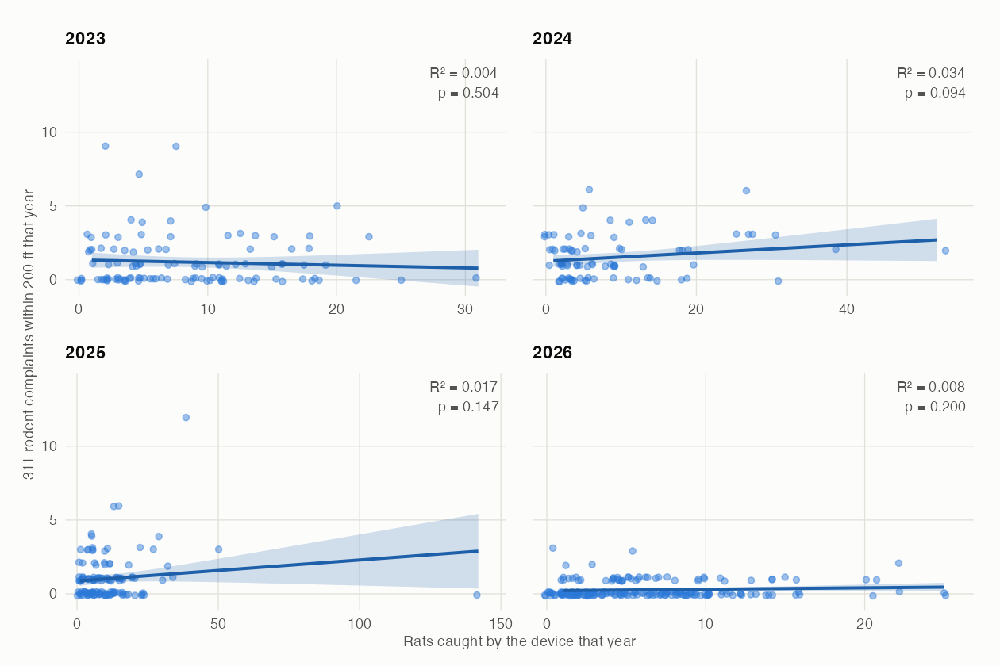

# Quick Start: Warmup by recreating a figure

New to this and not sure where to begin? Recreate the figure below. It is not from a publication — I made it as a demonstration. Work in **Python or R**. R may match more closely; that is what the original used.

The agent **cannot see this page**, so it cannot see the figure. It works from your prompt alone. Expect its version to differ based on both your choices and the agent's choices. 

---

## The figure



- **each point:** one box deployment in one year
- **x:** rats caught by that device during the year
- **y:** 311 rodent complaints filed within 200 ft of it, same year
- **panels:** 2023, 2024, 2025, 2026 · **line:** OLS fit with its 95% confidence band

---

## The prompt

Do this in **plan mode**, so you see the agent making its decisions before it executes them.

In plan mode the agent reads files and runs read-only commands, but **cannot edit anything until you approve a plan**.

```
Using data/raw/smart_rat_boxes.csv and data/raw/rodent_311.csv, make a figure that
answers this question:

    Does a smart rat box that catches more rats sit in an area where residents
    report more rodents?

Build it like this. Four panels in two rows, one per year: 2023, 2024, 2025, 2026.
One point per box deployment. The x axis is rats caught by that box during the
year. The y axis is the number of 311 rodent complaints filed within 200 ft of it
during the same year. Fit ordinary least squares within each panel, draw the 95%
confidence interval around the fit, and print R-squared and p in the top right
corner of the panel. Use the same y scale in every panel but let x run free, and
jitter the points a little so overlapping ones stay visible.

```

When it presents a plan you get three choices:

- **Yes, and use auto mode** — approve; the agent proceeds without asking per edit
- **Yes, manually approve edits** — approve; the agent asks before each edit
- **No, keep planning** — send it back with feedback, staying in plan mode
  - This is usually accompanied with a box where you can write feedback. If you're in VSCode, you can directly highlight sections of the plan and give feedback.

`Ctrl+G` opens the plan in your editor if you'd rather change it directly.


**Check the plan against this list before approving. These are some of the levers that will affect the plot**

- **Device type** — 456 above-ground `Box` rows and 56 sewer `Pipe` rows. Pipes were a retired pilot and hold the entire high-catch tail: 2023's top seven deployments are all Pipes. Pooling them flips two of the four slopes negative.
- **Deployments that caught nothing** — a 0 may mean "caught nothing" or "did not exist yet"; the file has no install date. Keeping them adds hundreds of points at x = 0 and can turn a null into two significant years.
- **Which coordinates** — `latitude`/`longitude` are rounded to 3–4 decimals, which is 11–110 m inside a **61 m** radius. The `coordinates` column carries 8 decimals. Most runs never notice there is a choice here.
- **Complaints near several boxes** — counted once for each box in range, so the y column does *not* partition the complaints. Nearest-box assignment would give a different figure.


Answer Key (not necessarily the best choices, but the ones that will reproduce the figure): the figure above uses `Box` only, drops deployments that caught nothing that year, and takes the rounded coordinates.

---

## Check your numbers

If the plan did the same analysis, it should reach the same numbers. Once the agent has built the figure, write this in the prompt:

```
For each year, report how many deployments went into the fit, the R-squared, the
p value and the slope. Then list every row of smart_rat_boxes.csv you left out,
and say why.
```

**Sanity checks** — the figure above gives:

- deployments per panel: **111 / 83 / 125 / 208** for 2023 / 2024 / 2025 / 2026
- R²: **0.004 / 0.034 / 0.017 / 0.008** · p: **0.504 / 0.094 / 0.147 / 0.200**
- **no year is significant**, and 2023's slope points the other way from the rest
- the count tells you which choices were made — but **not whether they were thought about**:

| deployments per panel | what that means |
|---|---|
| 510 / 510 / 510 / 510 | nothing was filtered |
| 454 / 454 / 454 / 454 | sewer pipes dropped |
| 131 / 95 / 135 / 217 | zero-catch dropped |
| **111 / 83 / 125 / 208** | **both — the figure above** |

---

## Definition of done

- Four panels, a visible confidence band, R² and p in each corner, and **no year significant**.
- Pixel-perfect styling is not the point. Matching the *pattern and the numbers* is.
- A different count is not a failure — go back to the list above and find which decision caused it.

---

## Discussion questions

This is the reflective half of the warmup — maybe make a journal entry for it:

1. **Which decisions did it make silently?** Compare its plan against the list above. How many did it state, how many did you have to ask about, and how many never came up at all?
2. **Trust & effort.** Where did the agent need correcting? Was there a step you'd want to run at higher effort because an error would be costly?
3. **Who actually decided?** If the agent asked you to pick, did you read the options or take the recommended one? Could you defend the choice you made?
